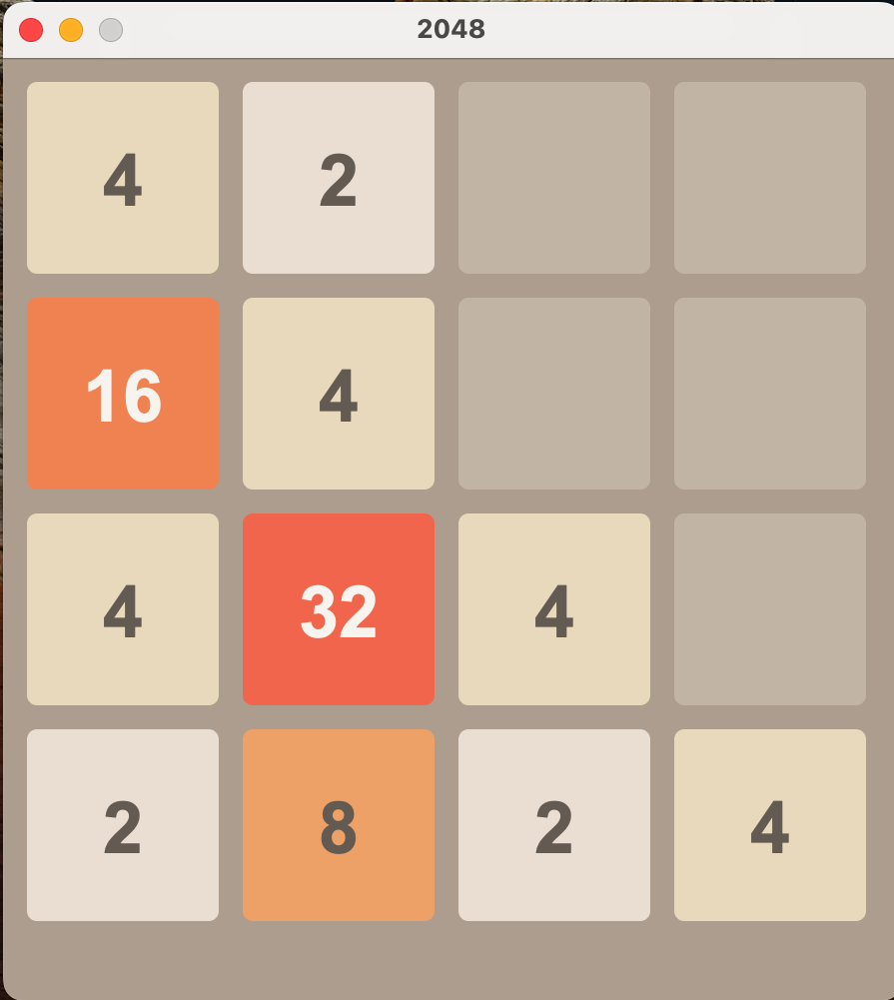

# 2048

Цель проекта написать игру 2048.

* Сдвиг плиток с помощью клавиш управления курсором
* ESC для новой игры
* Цвета для каждой плитки как в игре 2048
* Проверка на возможность совершения следующего хода

### Запуск

1. Загрузить/Склонировать репозиторий

        git clone https://github.com/Alex5067/2048
2. `cd` в директорию src и выполнить `javac Main.java` или просто запустить "My_2048.jar" из root директории

        cd 2048/src
        javac Main.java

3.  Выполнить `open Main.class` из директории src.
   

